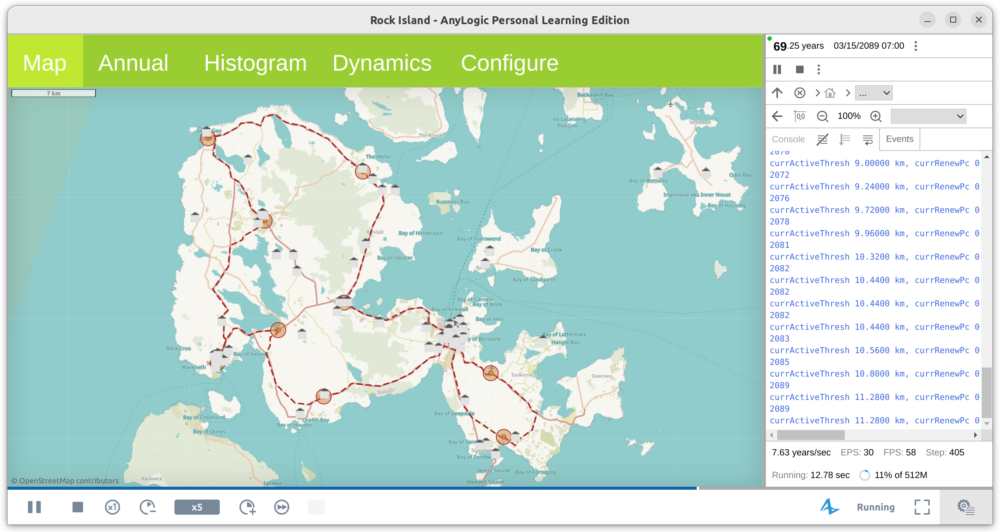
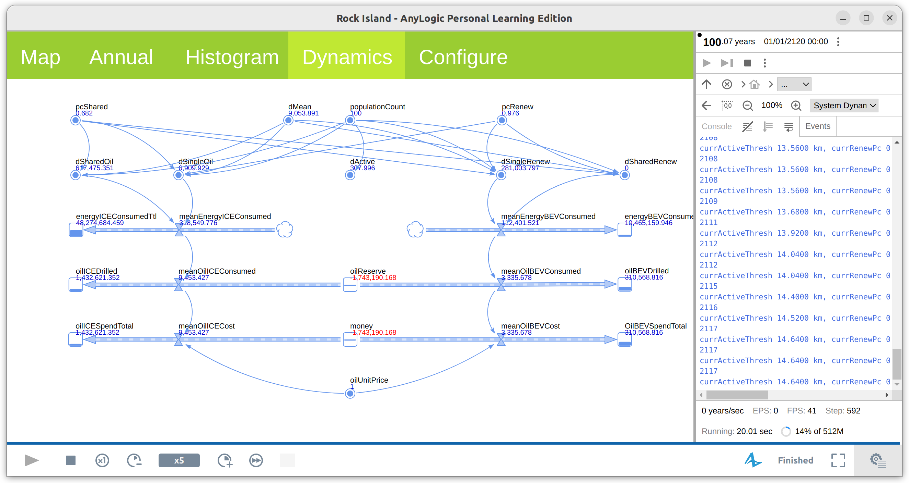
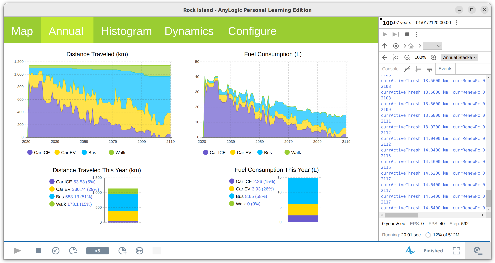
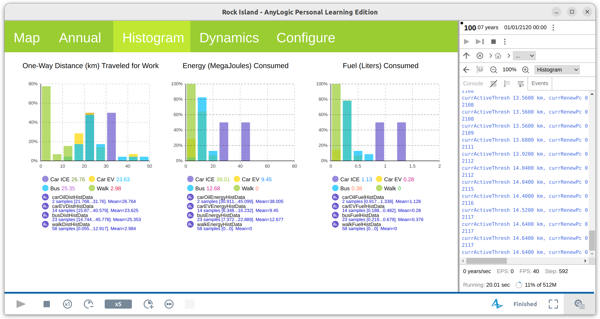
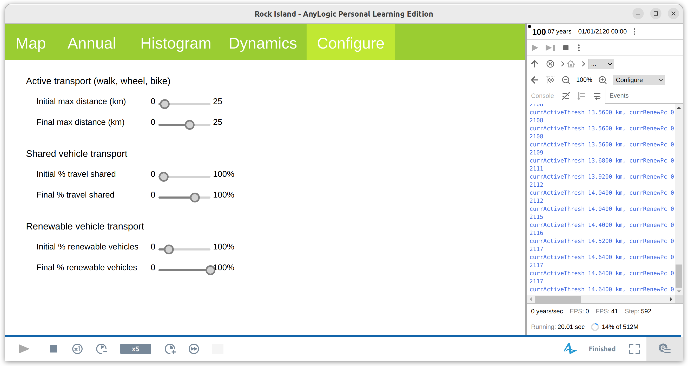

A proof-of-concept AnyLogic geospatial and system dynamimcs simulation to model the energy transition in transportation on a hypothetical island.

## System requirements

Dependencies: [AnyLogic](https://www.anylogic.com/) 8.9 free Personal Learning Edition

Tested on Ubuntu 22.04

## Sample outputs

### Geospatial map

Consider a hypothetical island, where the population from various areas commute each day to a central location for work. The energy consumed by each method of commute will be compared.

For purely convenient illustration purposes, the map of Orkney is used, and Kirkwall is chosen as the commute target. This is not meant to reflect the actual application of the theoretical ideas in this work, as even island-wide bike paths, not to mention rails, are far from realistic in Orkney at the time of writing. This choice of map is only meant for theoretical illustration of the geospatial relationship between transport modes.

To represent local areas, 100 postal codes (house icons in image) are chosen at random, out of 844 possible postal codes at time of writing.

An alternative transport loop (red dashed line) has been drawn to connect all the major towns (orange circles) on this island. This is meant to represent a mass public transport mode that consumes electricity, such as trams and light rails, which are often alternatives to car transport in urban areas.

### System dynamics

The system dynamics of total commute distances traveled by all areas, percentage of multi-passenger vehicles, percentage of renewable vehicles, energy consumption, and fuel consumption are modeled.

Note that the data underlying this model come from general UK data.

### Fuel consumption of various transport modes

Four transport modes are considered: single-passenger fossil fuel-consuming vehicle with internal combustion engine (ICE), multi-passenger fossil fuel-consuming vehicle, single-passenger electric vehicle, and active transport (cycle, walk, etc.).

For each transport mode, the distance traveled, energy consumption, and fuel consumption are calculated over a timespan of 100 years.

### Configuration

The user has the ability to configure the initial (year 0) and final (year 100) conditions of the simulation, in the maximum distance possible for active transport, the percentage of shared vehicles on the road, and the percentage of renewable vehicles on the road:

## Caveats

- The map of Orkney Islands is chosen for convenience of illustration and proof of concept. The data on vehicles and fuel consumption come from general UK data and do not reflect Orkney-specific vehicle distribution. It may or may not be representative of the actual consumption patterns of this geographical area.
- Postal code locations off the main island will need to be pruned, as transport will involve ferries, which are not yet in the data considered.
